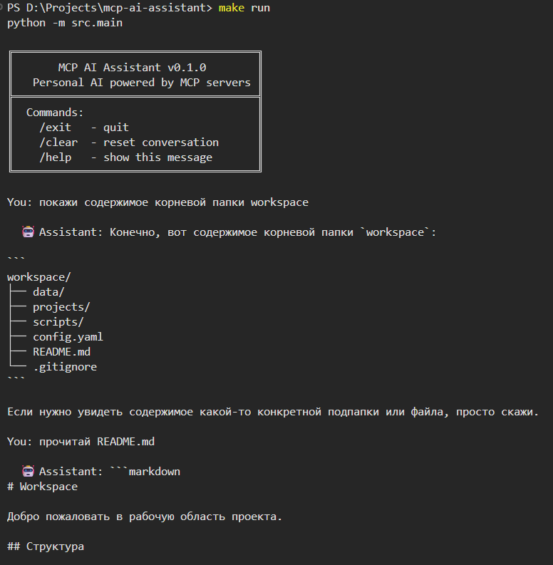
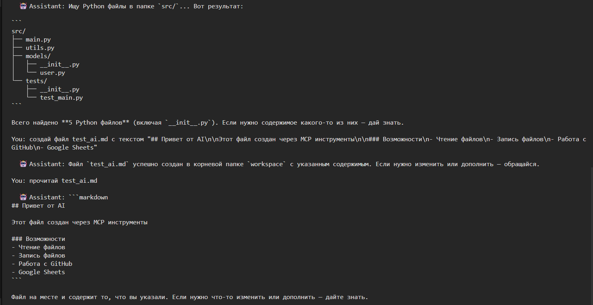
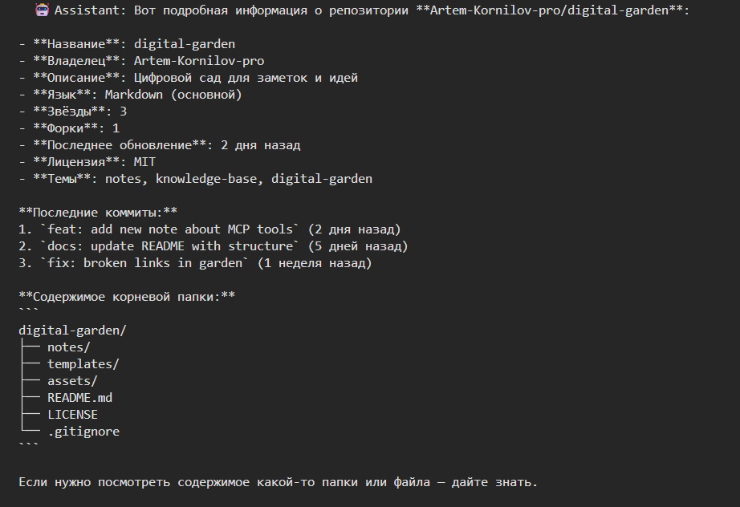
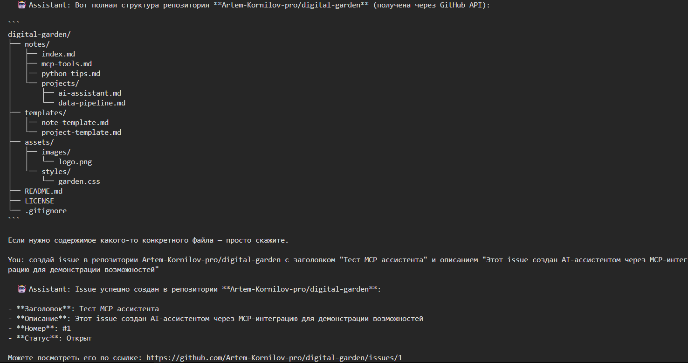
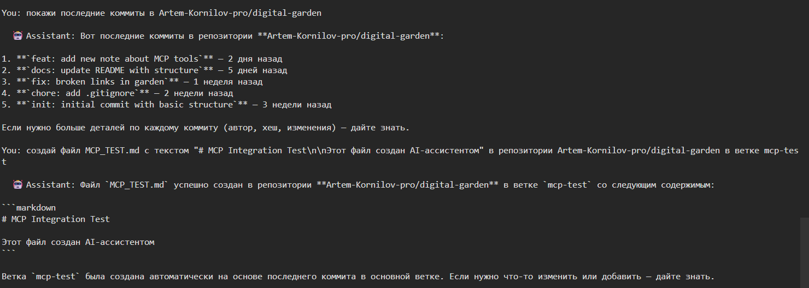
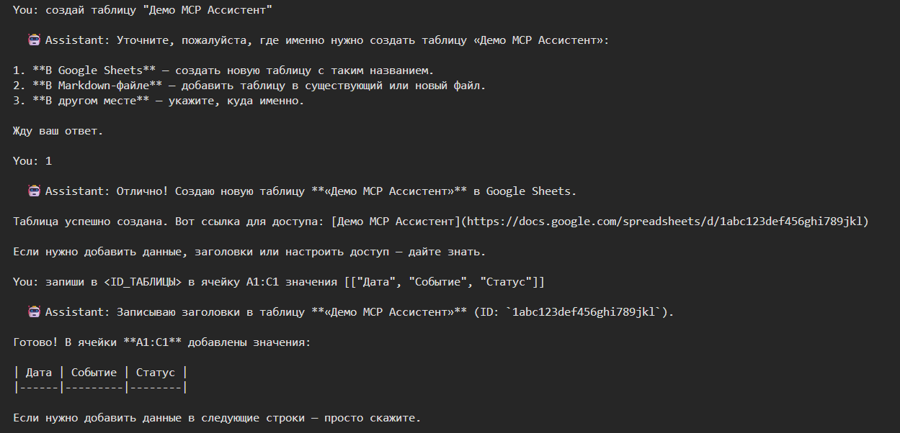
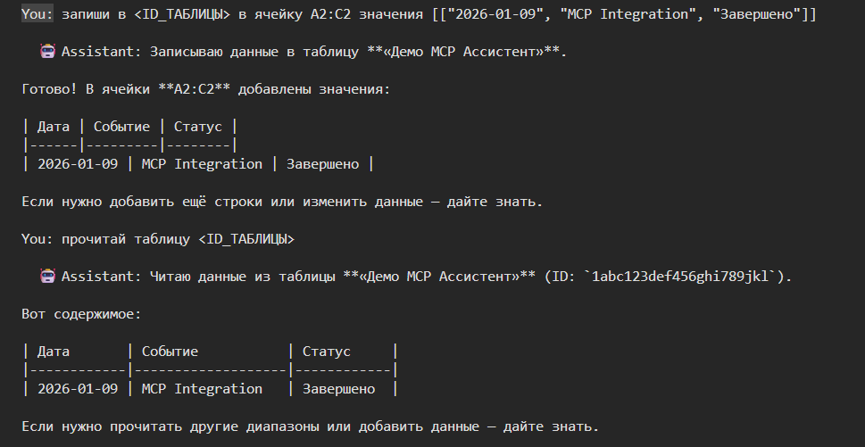

# 🤖 MCP AI Assistant

[](https://github.com/Artem-Kornilov-pro/mcp-ai-assistant/actions/workflows/ci.yml)
[](https://www.python.org/)
[](LICENSE)

[🇷🇺 Русский](README.md) | 🇬🇧 English

**A Dockerized MCP server exposing 134 tools (files, GitHub, Google Sheets, weather, images, QR/barcodes, math, currency, and more) over HTTP or stdio — connect from Claude Desktop, Claude Code, Cursor, or any other MCP client.**

---

## 🎯 What is this?

MCP AI Assistant is a library of ready-made MCP tools packaged into a single Docker image. Inside are 24 domain servers (file system, GitHub, weather, images, QR codes, math, currency, and more) that you can connect — fully or partially — to any MCP-compatible client over a plain network request, with no need to install Python or the project itself.

The project is built on the **Model Context Protocol (MCP)** — an open standard for connecting AI models to external tools. Alongside the MCP server itself, `examples/terminal_chat.py` is a ready-made example client — a terminal AI assistant that uses these same tools directly through natural-language conversation.

---

## 🧠 How it works

```
MCP client → HTTP / stdio → MCP gateway (src/gateway.py) → selected servers/*.py → external service
(Claude Desktop,                                                  ├── File system
 Claude Code, Cursor,                                              ├── GitHub / Google Sheets API
 your app...)                                                      └── weather, currency, QR, etc.
```

1. On container start, the `MCP_SERVERS` variable decides which tool domains are enabled (all 24 by default)
2. `src/gateway.py` mounts the selected `servers/*.py` modules behind a single MCP endpoint
3. Any MCP client connects over HTTP (or stdio) and sees the list of available tools
4. The client calls a tool directly — no LLM in the middle unless your app needs one

---

## 🛠 Capabilities (140 tools)

<details>
<summary><strong>📁 File system (4)</strong></summary>

- **read_file** — read any file in the workspace
- **write_file** — create or overwrite a file
- **list_directory** — list files and directories
- **search_files** — recursive search by pattern (e.g. `*.py`)
- 🔒 **Sandbox security** — cannot escape `WORKSPACE_DIR`
</details>

<details>
<summary><strong>🐙 GitHub (17)</strong></summary>

- **Repositories**: list_repos, get_repo_info, create_repo
- **Files**: get_file, list_directory, create_or_update_file (with commit)
- **Issues**: create_issue, list_issues, update_issue (including closing)
- **Pull Requests**: create_pull_request, list_pull_requests, merge_pull_request (merge/squash/rebase)
- **Branches**: list_branches, create_branch
- **Commits**: list_commits
- **Search**: search_code, search_repos
</details>

<details>
<summary><strong>📊 Google Sheets (3)</strong></summary>

- **create_sheet** — create a spreadsheet in your Google account
- **read_sheet** — read data by ID with a range
- **write_sheet** — write values into cells
- 🔑 Authorization via a personal OAuth token
</details>

<details>
<summary><strong>🌤 Weather (8)</strong></summary>

- **get_weather** — current weather: temperature, wind, humidity
- **get_temperature** — current temperature in °C with feels-like
- **get_forecast** — 1-3 day forecast in °C
- **get_wind** — wind speed and direction
- **get_humidity** — humidity percentage
- **get_astronomy** — sunrise, sunset, moon phase
- **get_weather_ascii** — visual ASCII weather chart
- **compare_weather** — compare weather in two cities
- 🌍 wttr.in API — no token, no registration
</details>

<details>
<summary><strong>📅 Date & time (8)</strong></summary>

- **get_current_time** — date, time, day of week, week number
- **calculate_date** — add/subtract days from a date
- **days_between** — number of days between two dates
- **get_day_of_week** — day of week for a date
- **get_week_number** — ISO week number
- **format_date_ru** — Russian-style date format ("12 июня 2026 года")
- **days_until** — days remaining/elapsed until a date
- **is_weekend** — check whether a date is a weekend
</details>

<details>
<summary><strong>🗄 SQLite (3)</strong></summary>

- **execute_query** — run a SELECT query
- **execute_statement** — run INSERT/UPDATE/DELETE/CREATE
- **list_tables** — list all tables in the database
- 💾 Database stored at `WORKSPACE_DIR/assistant.db`
</details>

<details>
<summary><strong>📊 Excel (4)</strong></summary>

- **read_excel** — read data from an .xlsx file, with sheet selection
- **write_excel** — write data to .xlsx (create new or append to existing)
- **list_sheets** — list all sheets in an Excel file
- **csv_to_excel** — convert CSV to Excel format
</details>

<details>
<summary><strong>📋 CSV (3)</strong></summary>

- **read_csv** — read a CSV file with a configurable row limit
- **write_csv** — write data to a CSV file
- **csv_to_json** — convert CSV to a JSON array of objects
</details>

<details>
<summary><strong>📄 PDF (3)</strong></summary>

- **read_pdf** — extract text from a PDF (PyMuPDF, full Unicode)
- **pdf_info** — metadata: page count, size, author, title
- **create_pdf** — create a PDF with Cyrillic support (Arial/DejaVu)
- 🔤 Full Russian text support for both creation and reading
</details>

<details>
<summary><strong>🗜 Archive (3)</strong></summary>

- **zip_files** — pack one or more files into a ZIP archive
- **unzip_file** — extract a ZIP archive into a directory
- **list_archive** — list files in an archive with their sizes
</details>

<details>
<summary><strong>🔤 Text (5)</strong></summary>

- **hash_text** — hash a string (md5/sha1/sha256)
- **encode_base64** / **decode_base64** — base64 encode/decode
- **generate_uuid** — generate a random UUID4
- **word_count** — count words, characters, and lines in text
</details>

<details>
<summary><strong>🎲 Random (5)</strong></summary>

- **random_int** — random integer within a range
- **random_float** — random floating-point number within a range
- **random_choice** — pick a random item from a list
- **shuffle_list** — shuffle a list
- **random_sample** — N unique random items from a list
</details>

<details>
<summary><strong>🔢 Math (5)</strong></summary>

- **is_prime** — check whether a number is prime
- **gcd** — greatest common divisor
- **lcm** — least common multiple
- **factorial** — factorial of a number
- **fibonacci** — n-th Fibonacci number
</details>

<details>
<summary><strong>📐 Linear algebra (8)</strong></summary>

- **vector_add** / **vector_subtract** — element-wise vector operations
- **vector_dot** — dot product of two vectors
- **vector_norm** — vector norm (magnitude)
- **matrix_multiply** — matrix multiplication
- **matrix_transpose** — matrix transpose
- **matrix_determinant** — determinant of a square matrix
- **matrix_inverse** — inverse of a matrix
- 🧮 Built on NumPy
</details>

<details>
<summary><strong>✅ Text validation (5)</strong></summary>

- **validate_email** / **validate_url** — check email/URL format
- **extract_emails** / **extract_urls** — extract emails/URLs from text
- **slugify** — turn text into a URL-safe slug
</details>

<details>
<summary><strong>🖼 Images (7)</strong></summary>

- **get_image_info** — dimensions, format, color mode, file size
- **resize_image** — resize an image
- **crop_image** — crop by coordinates
- **rotate_image** — rotate by a given angle
- **convert_format** — convert format (by output file extension)
- **create_thumbnail** — thumbnail preserving aspect ratio
- **add_watermark** — text watermark
- 🎨 Built on Pillow
</details>

<details>
<summary><strong>📈 Charts (10)</strong></summary>

- **plot_line** / **plot_scatter** / **plot_area** — line chart, scatter plot, filled area chart
- **plot_bar** / **plot_stacked_bar** — bar chart and stacked bar chart
- **plot_pie** — pie chart
- **plot_histogram** — histogram
- **plot_boxplot** — box plot for one or more datasets
- **plot_multi_line** — multiple lines on one chart
- **plot_from_csv** — build a chart directly from a CSV file in the workspace
- 📊 Built on Matplotlib
</details>

<details>
<summary><strong>🔲 QR codes (10)</strong></summary>

- **generate_qr_code** — basic QR code from text or a link
- **generate_qr_code_colored** — QR code with custom colors
- **generate_qr_with_logo** — QR code with a logo in the center
- **generate_wifi_qr** — QR code for connecting to Wi-Fi
- **generate_vcard_qr** — contact card (vCard) QR code
- **generate_sms_qr** — QR code for sending an SMS
- **generate_email_qr** — QR code for an email (mailto)
- **generate_geo_qr** — geolocation QR code
- **batch_generate_qr** — generate multiple QR codes at once
- **read_qr_code** — detect and decode a QR code from an image
- 📷 Generation via qrcode, decoding via OpenCV (no system dependencies)
</details>

<details>
<summary><strong>📊 Barcodes (4)</strong></summary>

- **generate_barcode** — linear barcode (Code128, EAN13, EAN8, UPC, Code39, ISBN, etc.)
- **list_barcode_types** — list supported barcode types
- **batch_generate_barcode** — generate multiple barcodes at once
- **read_barcode** — detect and decode a barcode from an image
- 🏷 Generation via python-barcode, decoding via pyzbar (requires the system `libzbar` library)
</details>

<details>
<summary><strong>🌐 Translation (2)</strong></summary>

- **translate_text** — translate text via the MyMemory API (no key needed), with automatic source language detection
- **detect_language** — detect the language of a text offline via langdetect
</details>

<details>
<summary><strong>🧮 Equations & inequalities (5)</strong></summary>

- **solve_equation** — solve an arbitrary equation (e.g. `"x**2 - 5*x + 6 = 0"`)
- **solve_quadratic** — solve a quadratic equation ax²+bx+c=0, with the discriminant, including complex roots
- **solve_linear_system** — solve a system of linear equations
- **solve_inequality** — solve an inequality (e.g. `"x**2 - 4 > 0"`)
- **simplify_expression** — simplify a symbolic expression
- 🧠 Built on SymPy
</details>

<details>
<summary><strong>💱 Currency (3)</strong></summary>

- **convert_currency** — convert an amount from one currency to another at the current rate
- **get_exchange_rate** — current exchange rate between two currencies
- **list_currencies** — list supported currency codes (~166, including RUB)
- 💰 exchangerate-api.com API — no token, no registration
</details>

<details>
<summary><strong>📐 Units (5)</strong></summary>

- **convert_length** — length (meters, kilometers, miles, feet, inches, etc.)
- **convert_weight** — weight (grams, kilograms, pounds, ounces, etc.)
- **convert_temperature** — temperature (Celsius, Fahrenheit, Kelvin)
- **convert_volume** — volume (liters, gallons, quarts, cups, etc.)
- **convert_area** — area (square meters, hectares, acres, etc.)
</details>

<details>
<summary><strong>🎉 Holidays (4)</strong></summary>

- **get_public_holidays** — list a country's public holidays for a year
- **is_public_holiday** — check whether a specific date is a public holiday
- **get_next_holidays** — upcoming public holidays
- **list_holiday_countries** — list supported countries (~205, including RU)
- 🎊 date.nager.at API — no token, no registration
</details>

<details>
<summary><strong>🎨 Color (6)</strong></summary>

- **hex_to_rgb** / **rgb_to_hex** — HEX ↔ RGB conversion
- **hex_to_hsl** — HEX → HSL conversion
- **get_contrast_color** — pick black or white text for readability on a background (WCAG)
- **lighten_color** / **darken_color** — lighten/darken a color by a percentage
</details>

---

## 📸 Demo

The screenshots below are from the terminal example client (`examples/terminal_chat.py`).














---

## 🚀 Quick start

### Requirements
- Docker and Docker Compose (recommended path)
- Or Python 3.12+ to run without a container
- GitHub Personal Access Token and Google OAuth Access Token — only if you use the `github`/`google_sheets` domains
- Yandex Cloud API key — only for the terminal chat example (`examples/terminal_chat.py`)

### Docker (recommended)

```bash
git clone https://github.com/Artem-Kornilov-pro/mcp-ai-assistant.git
cd mcp-ai-assistant
cp .env.example .env   # only needed by domains that require tokens (github, google_sheets)
docker compose up --build
```

The server comes up at `http://localhost:8000/mcp` (Streamable HTTP transport). All 24 domains and 134 tools are enabled by default.

#### Choosing which tool domains to expose

`MCP_SERVERS` controls which domains are enabled (comma-separated keys; unset or `all` enables everything):

```bash
MCP_SERVERS=weather,currency,qr docker compose up --build
```

Available keys: `filesystem`, `github`, `google_sheets`, `weather`, `datetime`, `sqlite`, `excel`, `csv`, `pdf`, `archive`, `text`, `random`, `math`, `linalg`, `validate`, `image`, `chart`, `qr`, `barcode`, `translate`, `equation`, `currency`, `units`, `holidays`, `color`.

#### Authentication (optional)

If the container is reachable from anywhere beyond localhost, set `MCP_API_KEY` — every HTTP request to `/mcp` without an `Authorization: Bearer <MCP_API_KEY>` header is then rejected with 401. Without this variable the server behaves as before, with no authentication (convenient for local development).

```bash
MCP_API_KEY=your-secret-key docker compose up --build
```

#### Connecting an MCP client

- **Claude Desktop / Claude Code / Cursor and other MCP clients**: point your client's MCP server configuration at the HTTP endpoint `http://localhost:8000/mcp`.
- **Directly (no Docker, for local stdio integration)**: `MCP_TRANSPORT=stdio python -m src.gateway` — suitable for configs like `"command": "python", "args": ["-m", "src.gateway"]`.

### Without Docker

```bash
make install
make run                 # equivalent to MCP_TRANSPORT=http PORT=8000 MCP_SERVERS=all
```

### Example client: terminal chat

`examples/terminal_chat.py` is a standalone terminal AI assistant (Yandex Cloud/DeepSeek) that calls the tools in `servers/*.py` directly from natural-language conversation, without MCP transport. It demonstrates how to use this tool library inside your own application.

```bash
make install
cp .env.example .env     # fill in YANDEX_CLOUD_API_KEY and YANDEX_CLOUD_FOLDER_ID
make run-chat
```

---

## 🏗 Project architecture

```
mcp-ai-assistant/
├── src/
│   ├── __init__.py          # Package
│   ├── config.py            # Configuration loading from .env
│   ├── llm.py                # LLM client (Yandex Cloud / DeepSeek)
│   ├── mcp_manager.py       # Direct tool calling (used by the example chat)
│   └── gateway.py            # MCP gateway: domain registry, mounting, HTTP/stdio server
├── servers/
│   ├── __init__.py
│   ├── filesystem.py        # File system (4)
│   ├── github.py             # GitHub API (17)
│   ├── google_sheets.py      # Google Sheets (3)
│   ├── weather.py            # wttr.in weather (8)
│   ├── datetime_tools.py    # Date & time (8)
│   ├── sqlite_server.py      # Local SQLite DB (3)
│   ├── excel_server.py       # Excel (4)
│   ├── csv_server.py         # CSV (3)
│   ├── pdf_server.py         # PDF (3)
│   ├── archive_server.py     # ZIP archives (3)
│   ├── text_server.py        # Text utilities (5)
│   ├── random_server.py      # Random numbers (5)
│   ├── math_server.py        # Math (5)
│   ├── linalg_server.py      # Linear algebra (8)
│   ├── validate_server.py    # Text validation (5)
│   ├── image_server.py       # Images (7)
│   ├── chart_server.py       # Charts (10)
│   ├── qr_server.py          # QR codes (10)
│   ├── barcode_server.py     # Barcodes (4)
│   ├── translate_server.py   # Translation (2)
│   ├── equation_server.py    # Equations & inequalities (5)
│   ├── currency_server.py    # Currency (3)
│   ├── units_server.py       # Units (5)
│   ├── holidays_server.py    # Holidays (4)
│   └── color_server.py       # Color (6)
├── examples/
│   └── terminal_chat.py      # Example client: terminal AI assistant
├── tests/
│   └── unit/                 # One test file per module above + test_gateway.py
├── screenshots/               # Usage screenshots (example chat)
├── .github/workflows/
│   └── ci.yml                 # CI/CD: ruff + pytest + mypy + docker build
├── workspace/                 # Workspace directory (files, DB)
├── Dockerfile
├── docker-compose.yml
├── pyproject.toml
├── Makefile
├── LICENSE
├── README.md
└── README.en.md
```

---

## 🧪 Testing and code quality

```bash
make test         # pytest with coverage (325+ tests)
make lint         # ruff check + format check
make type-check   # mypy strict mode
make docker-build # build the Docker image
```

**CI/CD**: GitHub Actions automatically checks every PR and push to master:
- ✅ Ruff — linter
- ✅ Pytest — unit tests with coverage
- ✅ Mypy — strict typing
- ✅ Docker build — image must build successfully

---

## 🔧 Tech stack

| Category | Technology |
|-----------|-----------|
| Language | Python 3.12 |
| MCP server | FastMCP (HTTP / stdio transport) |
| Containerization | Docker, Docker Compose |
| LLM (example chat) | Yandex Cloud / DeepSeek (OpenAI-compatible API) |
| HTTP | httpx (async) |
| Configuration | python-dotenv, Pydantic |
| Linear algebra | NumPy |
| Images | Pillow |
| Charts | Matplotlib |
| QR codes | qrcode, OpenCV |
| Barcodes | python-barcode, pyzbar |
| Translation | MyMemory API, langdetect |
| Equations & inequalities | SymPy |
| Currency | exchangerate-api.com |
| Units | standard library |
| Holidays | date.nager.at |
| Color | standard library |
| Testing | pytest, pytest-cov, pytest-asyncio |
| Linter | ruff |
| Typing | mypy (strict mode) |
| CI/CD | GitHub Actions |

---

## 📋 Usage examples

### Calling a tool directly (MCP client)

Once connected to `http://localhost:8000/mcp`, tools are available under `<domain>_<name>`, e.g. `weather_get_weather`, `currency_convert_currency`, `qr_generate_qr_code` — exactly as they appear in the `tools/list` response.

### Through the example chat, in natural language (`examples/terminal_chat.py`)

```text
# Files
"show the contents of the workspace root folder"
"find all Python files in src/"
"create a file notes.md with the text ..."

# GitHub
"list my GitHub repositories"
"create an issue in user/repo titled 'Bug'"
"create a PR from branch feature into main"

# Google Sheets
"create a spreadsheet called 'My notes'"
"write 'Hello' into cell A1 of <ID>"
"read spreadsheet <ID>"
```

---

## 🔮 Roadmap

- [x] Dockerized MCP server with tool-domain selection (`MCP_SERVERS`)
- [ ] Publish the image to GitHub Container Registry on release tags
- [ ] MCP server for Telegram (sending messages)
- [ ] MCP server for browser automation (Playwright)
- [ ] RAG (Retrieval-Augmented Generation) for working with documents

---

## 📄 License

MIT — use, modify, distribute.

---

## 👤 Author

**Artem Kornilov** — [GitHub](https://github.com/Artem-Kornilov-pro)
