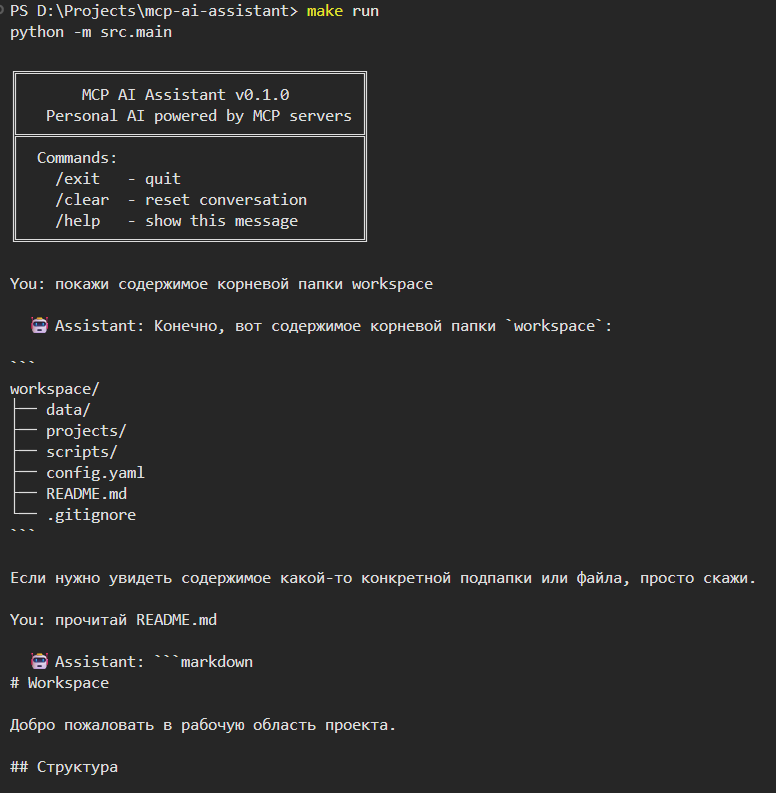
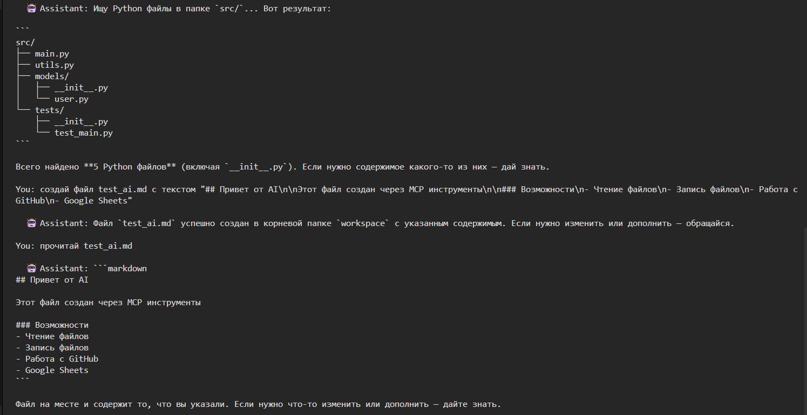
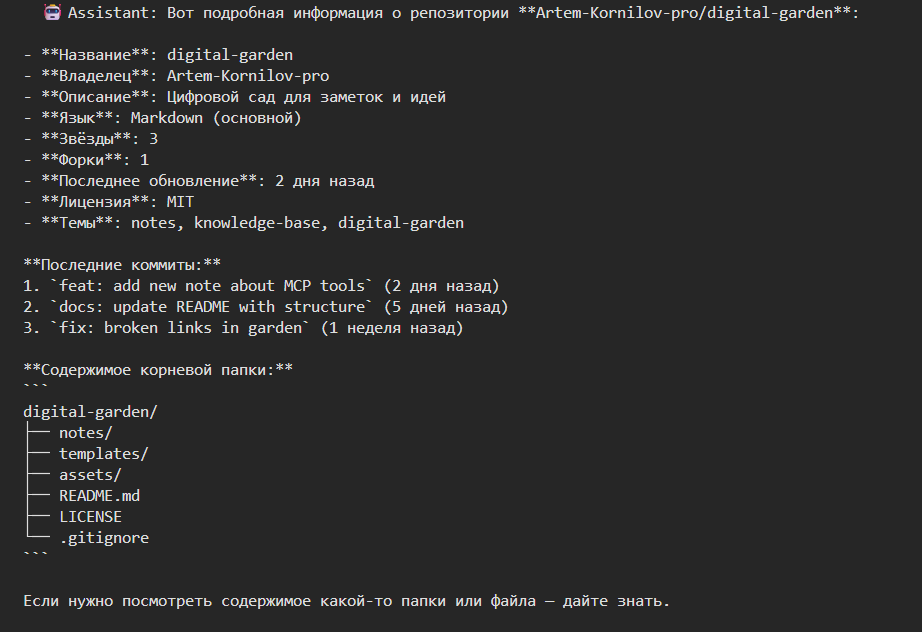
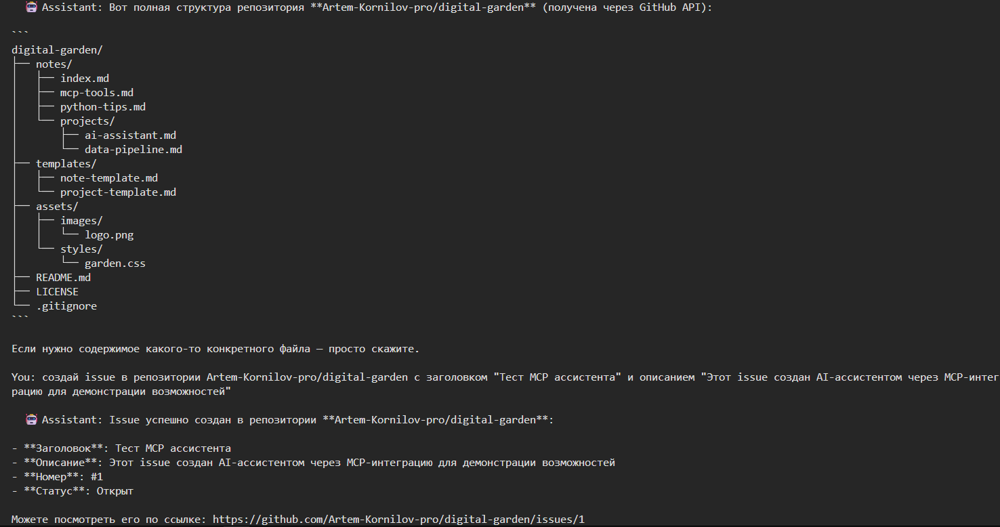
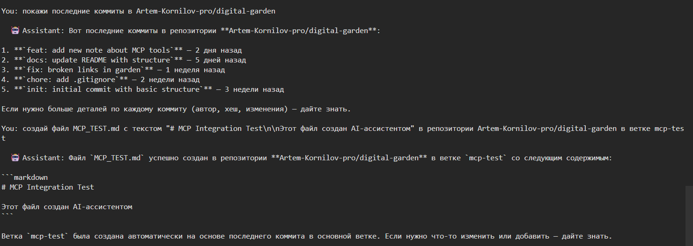
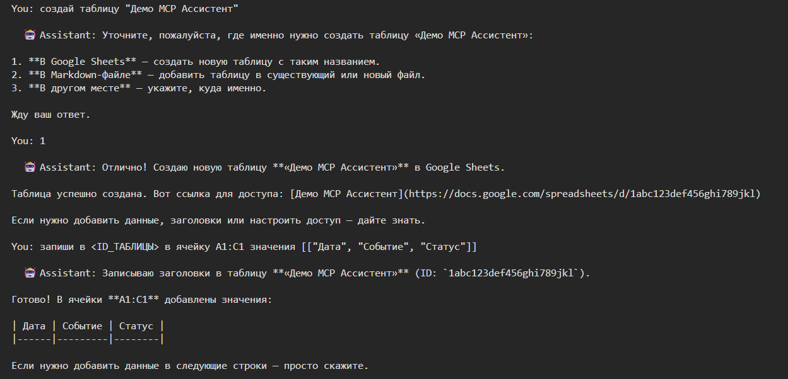
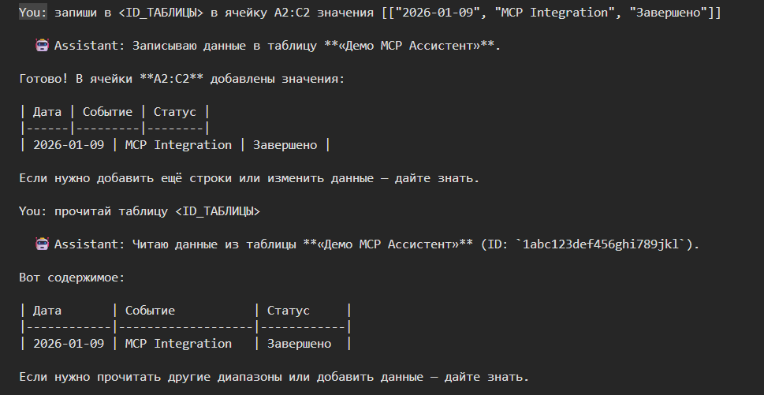

# 🤖 MCP AI Assistant

[](https://github.com/Artem-Kornilov-pro/mcp-ai-assistant/actions/workflows/ci.yml)
[](https://www.python.org/)
[](LICENSE)

**Персональный AI-ассистент с MCP-архитектурой, способный управлять файлами, GitHub и Google Sheets через естественный язык.**

---

## 🎯 Что это?

MCP AI Assistant — это терминальный AI-помощник, который не просто отвечает на вопросы, а **совершает действия** в реальном мире. Он умеет читать и писать файлы, управлять GitHub-репозиториями, создавать issues и pull requests, работать с Google Sheets — и всё это через обычный диалог.

Проект построен на **Model Context Protocol (MCP)** — открытом стандарте для подключения AI-моделей к внешним инструментам.

---

## 🧠 Как это работает

```
Пользователь → Терминал → LLM (DeepSeek) → MCP Server → Внешний сервис
                                                  ├── Файловая система
                                                  ├── GitHub API
                                                  └── Google Sheets API
```

1. Вы пишете запрос на естественном языке
2. LLM анализирует запрос и решает, какие инструменты нужны
3. MCP-сервер выполняет вызов API
4. Результат возвращается в диалог

---

## 🛠 Возможности (53 инструмента)

### 📁 Файловая система (4)
- **read_file** — чтение любого файла в рабочей директории
- **write_file** — создание или перезапись файла
- **list_directory** — список файлов и папок
- **search_files** — рекурсивный поиск по маске (например, `*.py`)
- 🔒 **Sandbox-безопасность** — нельзя выйти за пределы `WORKSPACE_DIR`

### 🐙 GitHub (17)
- **Репозитории**: list_repos, get_repo_info, create_repo
- **Файлы**: get_file, list_directory, create_or_update_file (с коммитом)
- **Issues**: create_issue, list_issues, update_issue (включая закрытие)
- **Pull Requests**: create_pull_request, list_pull_requests, merge_pull_request (merge/squash/rebase)
- **Ветки**: list_branches, create_branch
- **Коммиты**: list_commits
- **Поиск**: search_code, search_repos

### 📊 Google Sheets (3)
- **create_sheet** — создание таблицы в вашем Google-аккаунте
- **read_sheet** — чтение данных по ID с указанием диапазона
- **write_sheet** — запись значений в ячейки
- 🔑 Авторизация через личный OAuth-токен

### 🌤 Погода (8)
- **get_weather** — текущая погода: температура, ветер, влажность
- **get_temperature** — температура в °C с ощущением
- **get_forecast** — прогноз на 1-3 дня в °C
- **get_wind** — скорость и направление ветра
- **get_humidity** — влажность в процентах
- **get_astronomy** — рассвет, закат, фаза луны
- **get_weather_ascii** — визуальный ASCII-чарт погоды
- **compare_weather** — сравнение погоды двух городов
- 🌍 API wttr.in — без токена, без регистрации

### 📅 Дата и время (8)
- **get_current_time** — дата, время, день недели, неделя года
- **calculate_date** — прибавить/вычесть дни от даты
- **days_between** — разница в днях между датами
- **get_day_of_week** — день недели для даты
- **get_week_number** — номер недели по ISO
- **format_date_ru** — формат "12 июня 2026 года"
- **days_until** — сколько дней осталось/прошло
- **is_weekend** — проверка на выходной

### 🗄 SQLite (3)
- **execute_query** — выполнить SELECT-запрос
- **execute_statement** — выполнить INSERT/UPDATE/DELETE/CREATE
- **list_tables** — список всех таблиц в базе
- 💾 База хранится в `WORKSPACE_DIR/assistant.db`

### 📊 Excel (4)
- **read_excel** — чтение данных из .xlsx файла с указанием листа
- **write_excel** — запись данных в .xlsx (создание нового или дополнение существующего)
- **list_sheets** — список всех листов в Excel-файле
- **csv_to_excel** — конвертация CSV в формат Excel

### 📋 CSV (3)
- **read_csv** — чтение CSV-файла с настраиваемым лимитом строк
- **write_csv** — запись данных в CSV-файл
- **csv_to_json** — конвертация CSV в JSON-массив объектов

### 📄 PDF (3)
- **read_pdf** — извлечение текста из PDF (PyMuPDF, полный Unicode)
- **pdf_info** — метаданные: количество страниц, размер, автор, заголовок
- **create_pdf** — создание PDF с поддержкой кириллицы (Arial/DejaVu)
- 🔤 Полная поддержка русского текста при создании и чтении

---

## 📸 Демонстрация














---

## 🚀 Быстрый старт

### Требования
- Python 3.12+
- Yandex Cloud API ключ (для LLM)
- GitHub Personal Access Token
- Google OAuth Access Token (для Google Sheets)

### Установка
```bash
git clone https://github.com/Artem-Kornilov-pro/mcp-ai-assistant.git
cd mcp-ai-assistant
make install
```

### Настройка
```bash
cp .env.example .env
# Заполни .env своими ключами
```

### Запуск
```bash
make run
```

---

## 🏗 Архитектура проекта

```
mcp-ai-assistant/
├── src/
│   ├── __init__.py          # Пакет
│   ├── config.py            # Загрузка конфигурации из .env
│   ├── llm.py               # LLM-клиент (Yandex Cloud / DeepSeek)
│   ├── mcp_manager.py       # Менеджер MCP-инструментов
│   └── main.py              # Терминальный чат-интерфейс
├── servers/
│   ├── __init__.py
│   ├── filesystem.py        # Файловая система (4 инструмента)
│   ├── github.py            # GitHub API (17 инструментов)
│   ├── google_sheets.py     # Google Sheets (3 инструмента)
│   ├── weather.py           # Погода wttr.in (8 инструментов)
│   ├── datetime_tools.py    # Дата и время (8 инструментов)
│   └── sqlite_server.py     # Локальная SQLite БД (3 инструмента)
├── tests/
│   └── unit/
│       ├── test_llm.py
│       ├── test_cli.py
│       ├── test_filesystem.py
│       ├── test_github.py
│       ├── test_google_sheets.py
│       ├── test_weather.py
│       ├── test_datetime_tools.py
│       └── test_sqlite_server.py
├── screenshots/             # Скриншоты работы
├── .github/workflows/
│   └── ci.yml               # CI/CD: ruff + pytest + mypy
├── workspace/               # Рабочая директория (файлы, БД)
├── pyproject.toml
├── Makefile
├── LICENSE
└── README.md
```

---

## 🧪 Тестирование и качество кода

```bash
make test        # pytest с покрытием (56+ тестов)
make lint        # ruff check + format check
make type-check  # mypy strict mode
```

**CI/CD**: GitHub Actions автоматически проверяет каждый PR и push в master:
- ✅ Ruff — линтер
- ✅ Pytest — юнит-тесты с coverage
- ✅ Mypy — строгая типизация

---

## 🔧 Технологический стек

| Категория | Технология |
|-----------|-----------|
| Язык | Python 3.12 |
| LLM | Yandex Cloud / DeepSeek (OpenAI-совместимый API) |
| MCP | FastMCP |
| HTTP | httpx (асинхронный) |
| Конфигурация | python-dotenv, Pydantic |
| Тестирование | pytest, pytest-cov, pytest-asyncio |
| Линтер | ruff |
| Типизация | mypy (strict mode) |
| CI/CD | GitHub Actions |

---

## 📋 Примеры запросов

```text
# Файлы
"покажи содержимое корневой папки workspace"
"найди все Python файлы в src/"
"создай файл notes.md с текстом ..."

# GitHub
"покажи список моих репозиториев на GitHub"
"создай issue в user/repo с заголовком 'Баг'"
"создай PR из ветки feature в main"

# Google Sheets
"создай таблицу 'Мои заметки'"
"запиши в <ID> в ячейку A1 значение 'Привет'"
"прочитай таблицу <ID>"
```

---

## 🔮 Планы развития

- [ ] MCP-сервер для Telegram (отправка сообщений)
- [ ] MCP-сервер для работы с браузером (Playwright)
- [ ] Веб-интерфейс (FastAPI + WebSocket)
- [ ] Поддержка нескольких LLM-провайдеров (Ollama, Anthropic)
- [ ] RAG (Retrieval-Augmented Generation) для работы с документами
- [ ] Агентные цепочки (Agent Chains) для сложных сценариев

---

## 📄 Лицензия

MIT — используйте, модифицируйте, распространяйте.

---

## 👤 Автор

**Artem Kornilov** — [GitHub](https://github.com/Artem-Kornilov-pro)
